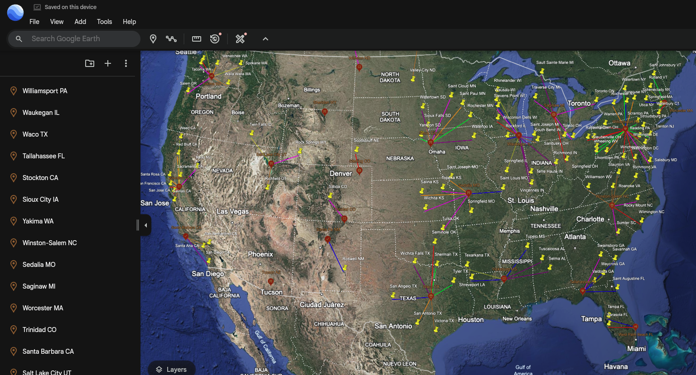
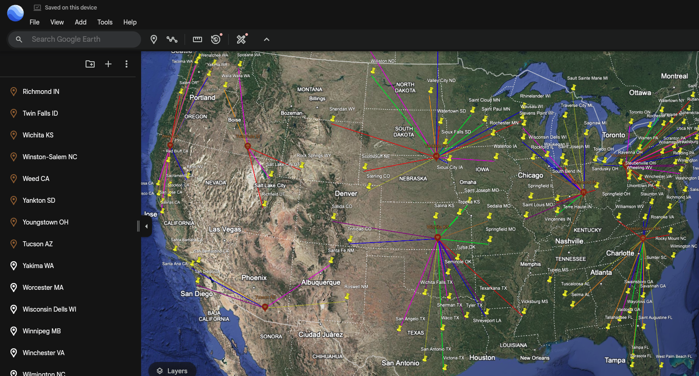

# Google Earth Visualization of Algorithm
Project 1 of Computer Science 1: Fundamentals course.
## Project Description

This project implements a facility location algorithm to solve the problem of optimally placing facilities to serve cities within a specified radius. The program analyzes city data including locations, populations, and distances between cities to determine the minimum number of facilities needed to serve all cities, with each city being within a specified radius from at least one facility.

### Dataset
The program uses a dataset called "miles.dat" which contains information about US cities including:
- City and state names
- Geographic coordinates (latitude and longitude)
- Population data
- Distances between cities

### Project Structure

The project consists of:
- `google_earth_visualization.py`: Main program that implements the facility location algorithm and generates KML files for Google Earth visualization
- `utils/miles.dat`: Dataset containing city information
- `utils/visualization*.kml`: Generated KML files for different radius values (e.g., 300, 800)
- `img/`: Directory containing screenshots of the Google Earth visualizations

### How to Run

1. Make sure the "miles.dat" file is in the utils directory
2. Run the program with: `python google_earth_visualization.py`
3. Open the generated KML file(s) with Google Earth to visualize the results
-- note Different radius values can be set by modifying the `r` variable in the code (line 314)

## Project Output

    
    

Outputs from google_earth_visualization.py viewed inside of Google Earth

Left: Visualization300.kml,  Right: Visualization800.kml

## Source Code
- [google_earth_visualization.py](googleEarthVisualization.py)