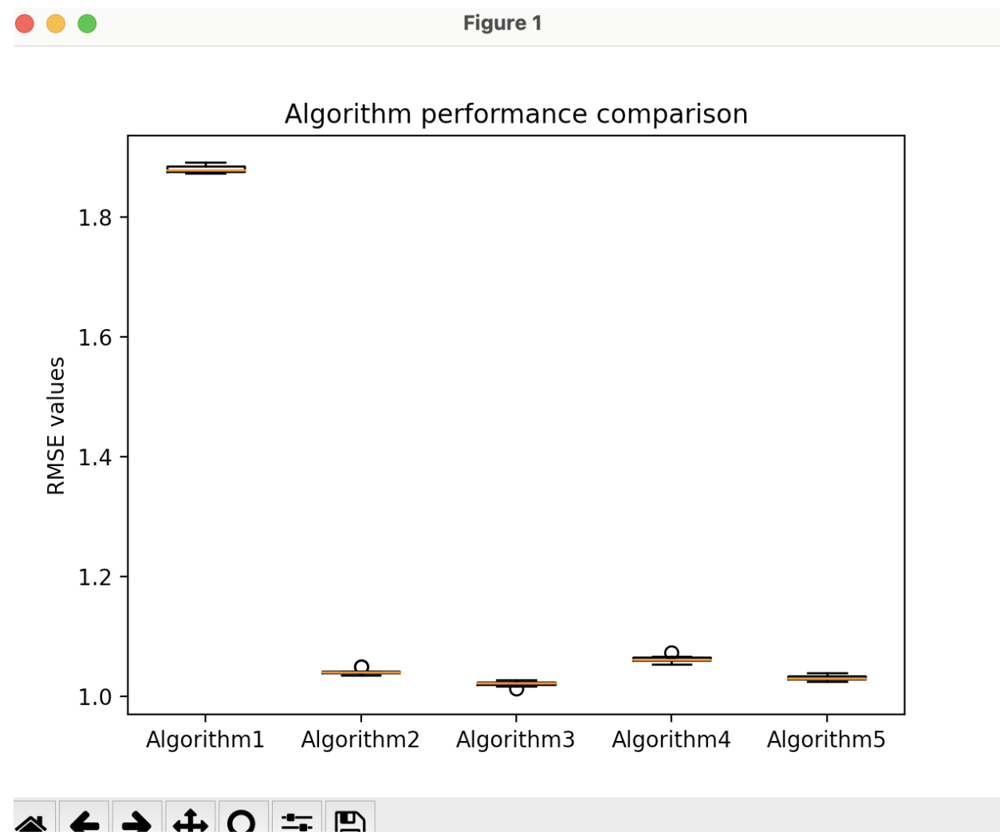

# Movie Rating Algorithm
Project 2 of Computer Science 1: Fundamentals course.
## Project Description

This Python project implements a movie recommendation system using the MovieLens dataset (folder named ml-100k). The system analyzes user ratings and demographic information to predict how users might rate movies they haven't seen yet.

### Dataset

The project uses the MovieLens 100k dataset, which contains:
- 100,000 ratings (1-5) from 943 users on 1,682 movies
- Demographic information about users (age, gender, occupation, zip code)
- Movie information (title, release date, genres)

### Project Structure
- `movie_rating_algorithm.py`: Main script that implements various rating prediction algorithms
- `ml-100k/`: Directory containing the MovieLens 100k dataset
- `img/`: Directory containing visualization outputs like the box and whisker plot

### How to Run

1. Download the MovieLens 100k dataset and extract it
2. Place the `ml-100k` folder in the project directory
3. Run the main script:
   ```
   python movie_rating_algorithm.py
   ```

## Project Output

The box and whisker plot above compares the performance of five different movie rating prediction algorithms by showing their Root Mean Square Error (RMSE) values across 10 experimental runs. Lower RMSE values indicate better prediction accuracy.

Each box represents the distribution of RMSE values for a specific algorithm:
- The horizontal line inside each box shows the median RMSE
- The box itself represents the interquartile range (middle 50% of the data)
- The whiskers extend to show the minimum and maximum values (excluding outliers)

## Source Code
- [movie_rating_algorithm.py](movie_rating_algorithm.py)